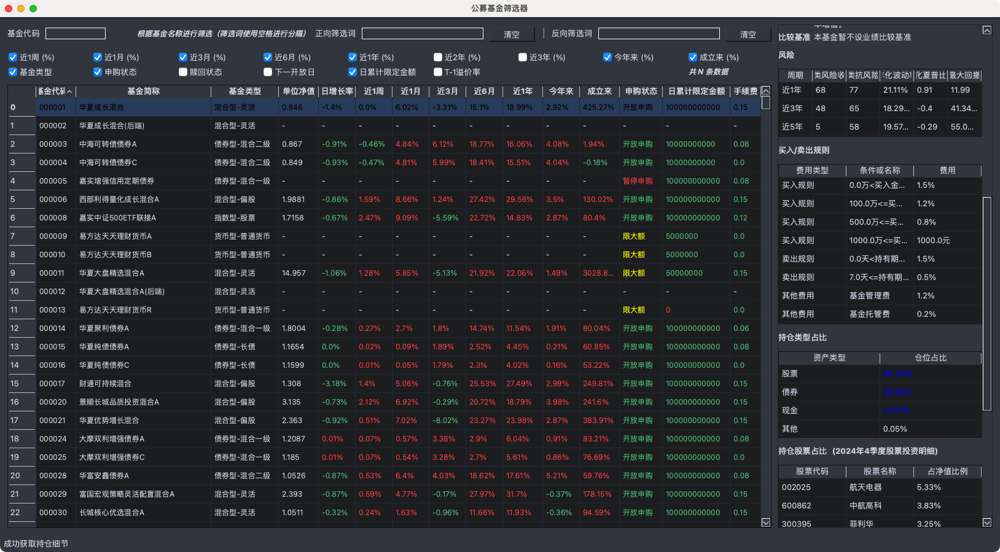

 
 
<b>Funder</b>

 
<b>更好的筛选公募基金</b>

<!-- 顶部至此截止 -->

# 可以做什么？

更方便的筛选公募基金，并获取该基金的详细信息！

- 获取市面上的所有基金
- 通过正向及反向筛选词对基金名称进行筛选
- 通过基金代码进行筛选
- 点击一只基金查看它的详细信息：
    - 基本信息
    - 风险（同类风险收益、年华波动率、夏普比率、最大回撤）
    - 买入/卖出规则
    - 持仓类型占比
    - 持仓股票占比
    - 盈利概率

